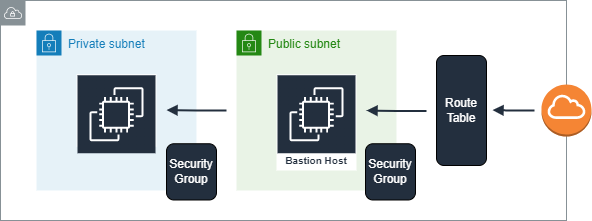

# Bastion Host

Bastion Host é uma **boa prática de segurança** quando pensamos em acesso às instâncias que estão rodando em uma subnet privada.

Para criarmos um Bastion Host devemos:

1. Provisionar uma instância em uma subnet pública.
2. Provisionar um *security group* que conceda acesso SSH (porta 22) à internet e vincular à nossa subnet pública.
3. Configurar o *security group* da subnet privada de modo à liberar acesso SSH somente ao Bastion Host.

Em poucas palavras, os security groups são os responsáveis por restringir acesso SSH das instâncias somente ao Bastion Host que por sua vez também restringirá o acesso SSH à internet.

## Arquitetura (Modelo)

