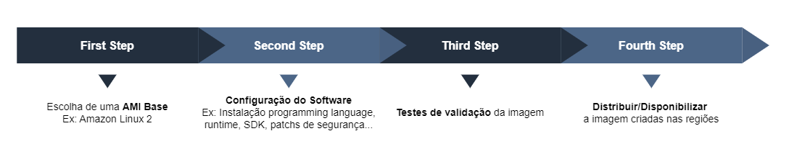

# EC2 Image Builder

O EC2 Image Builder é um serviço computacional responsável por automatizar o processo de criação, customização, manutenção e deploy de *AMI*s (Amazon Machine Images) assim como também *Container Images*.

Uma das *features* interessantes do *Image Builder* é o fato de automaticamente iniciar o fluxo de criação de novas imagens assim que atualizações de software estiverem disponíveis, essa imagem recém criada passará por testes de validação e poderá ser disponibilizada para as regiões desejadas caso passar nos testes.

> É possível compartilhar *AMI*s criadas no *Image Builder* para outras contas AWS.

## Fluxo

Para criarmos nossa imagem devemos passar pelo seguinte fluxo:

## Terminologia

- **Image Pipeline**: Configuração do processo de ponta-a-ponta para a criação da imagem, contém: *Image Recipe*, *Distribution* e *Tests*.

- **Image Recipe**: "Receita" da imagem criada, ela contém principalmente a *Source Image* e *Build Components*.
  > Possui controle de versão (versionamento)

- **Source Image**: *AMI* usada como base para criação da nova imagem.

- **Build Components**: São os componentes do software que serão incluídos na imagem, exemplo: .NET 8 e C# 12.