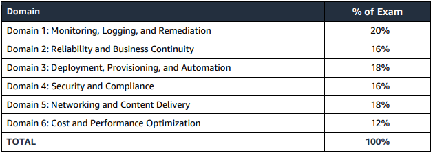

# AWS Certified SysOps Administrator Associate

Projeto de estudos de preparação para a certificação **AWS Certified SysOps Administrator Associate**.

## Domains:

O conteúdo apresentado neste projeto de estudos segue a mesma segregação em domínios que a certificação aborda.

### Mandatórios

Abaixo estão todos os domínios mandatórios para o exame:

- [Deployment, Provision & Automation](./domains/deployment-provision-and-automation/README.md)
- [Monitoring, Logging & Remediation](./domains/monitoring-logging-and-remediation/README.md)

### Recomendados

Abaixo temos alguns temas que não são teoricamente mandatórios, porém o conhecimento adquirido nesses domínios irá facilitar na resolução das questões de forma geral.

Dito isso, sua leitura é extremamente recomendada.

- [Storage & Data Management](./domains/storage-and-data-management/README.md)

**Domínios/porcentagem** que aparecem no exame:

