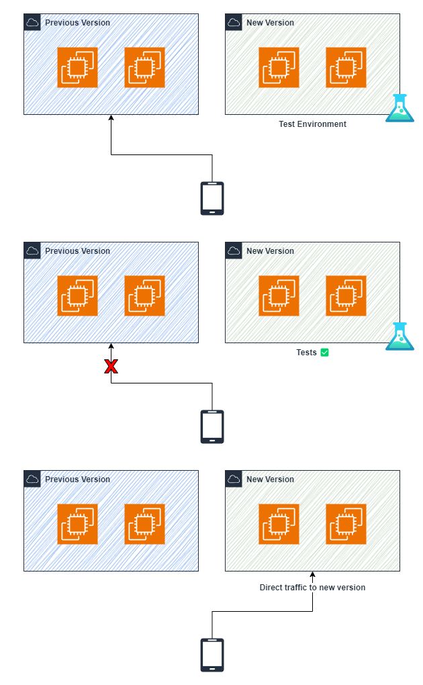

# Blue / Green Deployment

Blue / Green deployment é um modelo/estratégia de *deploy* (implantação). Neste modelo, existem dois ambientes idênticos um ao outro, um contendo uma nova versão da sua aplicação e outro contendo a versão antiga.

## Key Points

- **Low Risk Deployment Strategy**: Esta estratégia de implantação visa termos um baixo risco durante novas subidas ao ambiente produtivo, pois permite apenas o roteamento do tráfego as novas instâncias.
- **Enables Testing**: Devido termos um ambiente idêntico ao cenário produtivo apenas com a nova versão da aplicação, podemos rodar testes de carga ou de performance e validarmos se a subida ocorreu com sucesso antes de rotearmos o tráfego para ela.
- **Rollback Fast and Easy**: Possibilidade de *Rollback* devido os dois ambientes estarem co-existindo, apenas alterar o apontamento do tráfego para a versão antiga.

## Workflow

### Deployment

### Rollback

