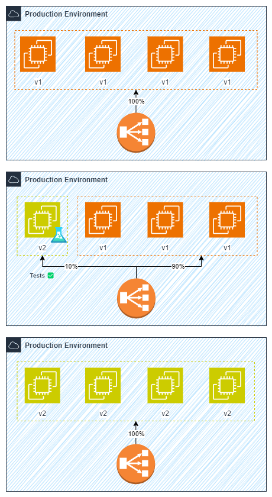
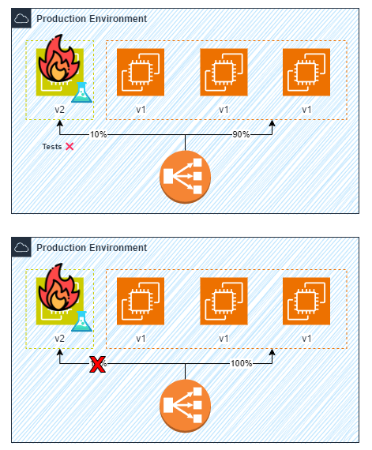

# Canary Deployment

Canary deployment é um modelo/estratégia de *deploy* (implantação) que baseia-se em realizar o deploy em um número pequeno de web servers e direcionar apenas uma pequena parcela do tráfego de usuários para esses novos web servers. Dessa forma, é possível validar as mudanças realizadas antes de realizar o roll out para todos os clientes.

## Key Points

- **Early Warning System**: Através deste modelo temos um aviso prévio de que algum problema ocorreu na nova versão.
- **Canary Testing**: Permite testarmos a nova versão da aplicação em produção com apenas uma parcela dos usuários.
- **Easy & Safe Rollback**: Permite o Rollback de forma fácil e rápida apenas direcionando o tráfego de volta a antiga versão.

## Workflow

### Deployment

### Rollback

