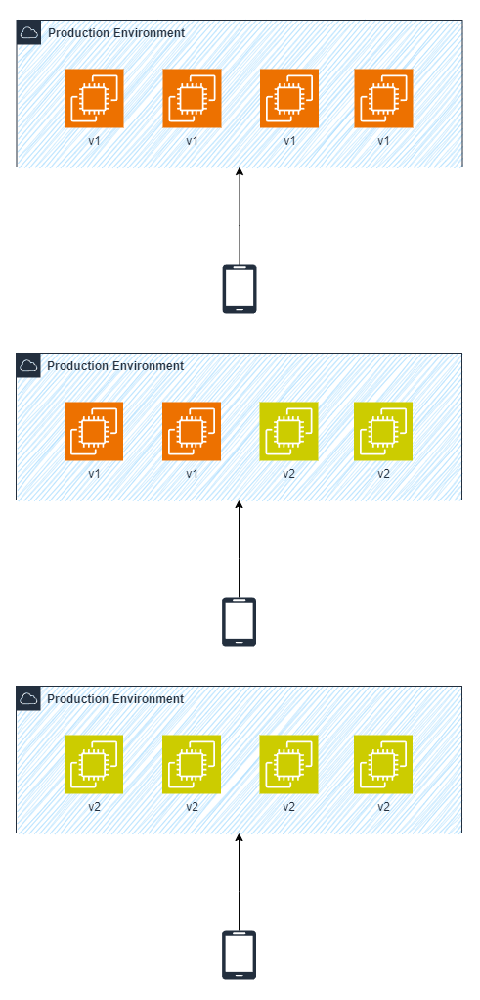
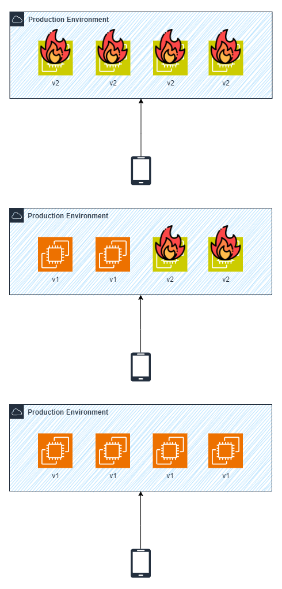

# Rolling Deployment

O Rolling Deployment é outro modelo/estratégia de *deploy* (implantação). Neste modelo, a implantação ocorre em *batches* (partes), dessa forma, algumas instâncias serão atualizadas para a nova versão enquanto outras permanecem na versão atual, quando finalizadas essas atualizações, as próximas instâncias passarão por esse mesmo processo até que todas elas sejam atualizadas concluindo o deploy.

## Key Points

- **Batches**: Modelo de deploy em *batches*, partes.
- **Cost Effective**: É uma estratégia de implantação mais barata, se comparada ao *blue/green*, pois não necessita de dois ambientes co-existindo durante o *deploy*.
- **Complexity**: A complexidade é maior, pois durante a implantação teremos duas versões da aplicação no ar, podendo causar erros de sincronização.
- **Rollback as Re-deploy**: Não possui uma maneira fácil para *rollback*, devemos realizar o *re-deploy* manual da antiga versão.

## Serviços

### CloudFormation

Este modelo de implantação pode ser utilizado em nossa stack do CloudFormation para, por exemplo, atualizar um conjunto de instâncias que estão rodando uma antiga versão da aplicação ou de componentes da aplicação, como o Apache.

Assim, basta definirmos qual a quantidade mínima de instâncias que desejamos/precisamos manter no ar durante o *deploy* e qual o tamanho do *batch size* (número de instâncias) que serão atualizadas em conjunto.

## Workflow

### Deployment

### Rollback

Visto que nesta estratégia não possuímos uma maneira "nativa" de rollback, é necessária a realização de um novo deploy da antiga versão.

