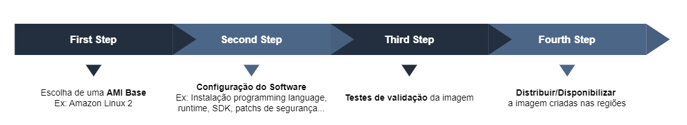

# EC2 Image Builder

O EC2 Image Builder é um serviço computacional responsável por automatizar o processo de criação, customização, manutenção e deploy de *AMI*s (Amazon Machine Images) assim como também *Container Images*.

Uma das *features* interessantes do *Image Builder* é o fato de automaticamente iniciar o fluxo de criação de novas imagens assim que atualizações de software estiverem disponíveis, essa imagem recém criada passará por testes de validação e poderá ser disponibilizada para as regiões desejadas caso passar nos testes.

> É possível compartilhar *AMI*s criadas no *Image Builder* para outras contas AWS.

## Fluxo

Para criarmos nossa imagem devemos passar pelo seguinte fluxo:

## Image Pipeline

Através das Image Pipelines, podemos realizar a criação e configuração da pipelines responsáveis pelo processo de ponta-a-ponta de criação das imagens. Sua configuração está dividida em: *Image Recipe*, *Infrastructure Configuration* e *Distribution Settings*.

### Image Recipe

Como o próprio nome diz, é a "receita" da imagem a ser criada, nela podemos configurar:

- **Source Image**: *AMI* usada como base para criação da nova imagem.
- **Build Components**: São os componentes do software que serão incluídos na imagem, exemplo: SDK do .NET 8, atualizações de seguranças, entre outros.
- **Test Components** (*Optional*): São os scripts de testes que iremos rodar em nossa imagem, exemplo: Simples *boot* do SO.

> A Image Recipe possui controle de versão (versionamento)

### Infrastructure Configuration

O Image Builder necessita prover algumas instâncias para conseguir customizar e validar (rodar os testes) as imagens, com isso podemos utilizar a configuração padrão ou criar nossa própria infra.

Para criação da infraestrutura devemos informar a *role* de execução, o tipo de instância que será utilizado, o tópico SNS que enviará as notificações dos status dos *builds*, alterar a VPC, *subnets*, *security groups*, entre outras configurações.

### Distribution Settings

É destinado as configurações de distribuição, que é basicamente a escolha da região em que iremos realizar o *deploy* de nossa imagem.