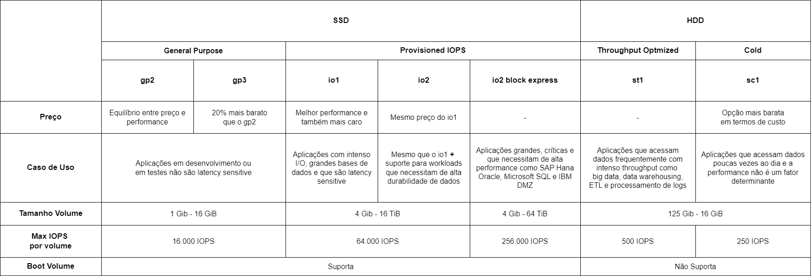

# EBS - Elastic Block Store

EBS são **volumes de armazenamento** (discos rígidos) a qual nossa instância estará rodando. Sempre que formos criar uma nova instância devemos informar qual será o tipo de volume que iremos vincular (*attach*) à ela. Cada volume possui características específicas a qual devem ser levadas em consideração para o tipo de atividade que será realizado.

De forma geral, utilizaremos os '*EBS volumes*' para criar *file systems*, rodar bancos de dados, rodar sistemas operacionais, armazenar dados ou instalar aplicações. 

## Características

- Desenvolvido para *Mission Critical Workloads*.

- **Highly Available** (Altamente Disponível): Os dados são replicados pela AZ (Availability Zone) para proteção contra falhas por padrão, não necessitando de nenhuma configuração adicional.

- **Scalable** (Escalável): Aumenta dinamicamente a capacidade de armazenamento e o tipo de volume sem *downtime* ou impacto na performance.

> Para o exame, é de extrema importância sabermos quais os tipos, as diferenças entre eles e quando usar cada um.

## Tipos de volume

### General Purpose SSD gp2

É o tipo com maior equilíbrio entre preço e performance, melhor "custo benefício".

**Caso de uso**: Aplicações em desenvolvimento ou em testes que não são sensíveis a oscilação de latência (*latency sensitive*).

**Especificações**:

- 3 IOPS por GB até o máximo de 16.000 IOPS por volume.
- < 1 TB o burst máximo pode ser até 3.000 IOPS.

### General Purpose SSD gp3

É a última geração do tipo general purpose.

**Mesmo caso de uso do gp2**, porém sendo **20% mais barato**.

**Especificações**:

- Baseline de 3.000 IOPS para qualquer volume (1 GB - 16 GB).
- Máximo de 16.000 IOPS.

### Provisioned IOPS SSD io1

A melhor performance, porém também o mais caro.

**Caso de uso**: Desenvolvido para aplicações com intenso I/O, grandes bases de dados e casos em que as aplicações são sensíveis a variação de latência.

**Especificações**:

- 50 IOPS por GB até o máximo de 64.000 IOPS por volume.

> Deve ser uma opção caso seja necessário mais do que 16.000 IOPS.

### Provisioned IOPS SSD io2

É a última geração do tipo provisioned IOPS.

**Mesmo preço em que o io1**, porém **mais durável** e **mais IOPS por GB**.

**Caso de uso**: O mesmo do io1 porém também é uma opção para *workloads* que necessitam de uma alta durabilidade dos dados.

**Especificações**:

- 500 IOPS por GB, máximo de 64.000 IOPS por volume.
- 99.999% de durabilidade

### Provisioned IOPS SSD io2 Block Express

Funciona como SAN (*Storage Area Network*) na núvem, possui a melhor performance de todos os tipos com uma latência abaixo dos milissegundos, devido utilizar um novo tipo de arquitetura chamado *EBS Block Express architecture*.

**Caso de uso**: Desenvolvido para aplicações grandes, críticas e que necessitam de alta performance como SAP HANA, Oracle, Microsoft SQL e IBM DBZ.

**Especificações**:

- 4x o throughput, IOPS e capacidade que os volumes do tipo io2.
- Máximo de 256.000 IOPS por volume até 64 TB.
- Também possui 99.999% de durabilidade.

### Throughput Optmized HDD st1

HD de baixo custo na nuvem.

**Caso de uso**: Aplicações que necessitam acessar dados frequentemente com intenso throughput, como big data, data warehousing, ETL e processamento de logs.

**Especificações**:

- Baseline de throughput de 40 MB/s por 1 TB, com burst até 250 MB/s por TB
- Máximo de 500 MB/s por volume

> Não pode ser usado como **boot volume**.

### Cold HDD sc1

Opção mais barata de todas, porém também com a menor performance.

**Caso de uso**: Aplicações em que os dados são acessados poucas vezes ao dia e performance não é um fator determinante.

**Especificações**:

- Baseline de throughput de 12 MB/s por 1 TB, com burst até 80 MB/s por TB
- Máximo de 250 MB/s por volume

> Não pode ser usado como **boot volume**.

## Comparação

## IOPS vs Throughput

### IOPS

Podemos entender IOPS como sendo a habilidade de realizar uma grande quantidade de operações por segundo, ela basicamente mede a quantidade de leituras e escritas por segundo que um *workload* pode realizar.

É uma métrica muito importante para aplicações que necessitam de uma grande quantidade de transações por segundo de forma rápida e com baixa latência.

### Throughput

Throughput pode ser entendido como a habilidade de lidar com grandes *datasets*, ou seja, grandes quantidades de dados em si, através dela podemos medir a quantidade de bits lidos ou escritos por aquele *workload*. 

Alguns casos de uso que necessitam de alto throughput são: bases de dados enormes, largo tamanho de IO's e *queries* complexas.