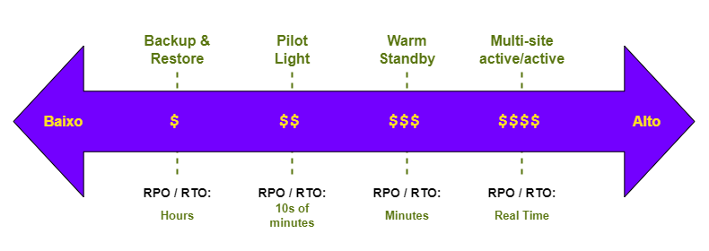

# Disaster Recovery Strategies

Atualmente temos diferentes estratégias cada uma com suas particularidades, prós e contras.

Como visto previamente, sempre devemos levar em conta o [RPO e RPO](../rto-and-rpo/README.md) da aplicação e do *business* a qual ela está inserida.

Além de nos basearmos em 3 pilares, para definirmos qual estratégia iremos adotar.

- Tempo de recuperação (*downtime*)
- Criticidade dos serviços
- Perdas (*data loss*)

## Strategies

**Comparação:**

| Stratégia                | Tempo de recuperação        | Criticidade                                         | Utilização                                                           |
| ------------------------ | --------------------------- | --------------------------------------------------- | -------------------------------------------------------------------- |
| Backup & Restore         | Horas                       | Casos de uso com baixa criticidade                  | *Restore* dos dados e *re-deploy* dos recursos após ocorrer o evento |
| Pilot Light              | Dezenas de minutos          | RPO/RTO menos rígidos, *core services* (essenciais) | Inicia a escalar os serviços logo após o evento                      |
| Warm Standby             | Minutos                     | RPO/RTO mais rígidos, *business critical services*  | Já escala os serviços logo após o evento                             |
| Multi-site active/active | Real-Time (sem interrupção) | *Zero downtime*, *mission critical services*        | Roteamento do tráfego para ambiente secundário                       |