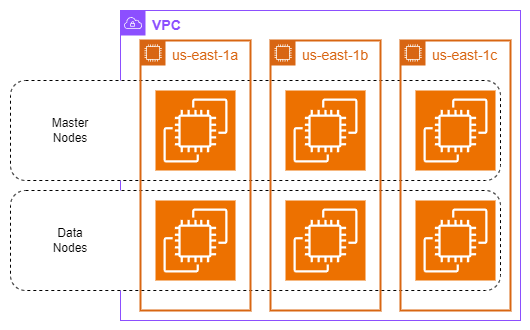

# Arquitetura do Opensearch

Para iniciarmos o uso do Opensearch, precisamos inicialmente criar nosso cluster do elasticsearch.

O cluster é dividido em dois grupos: master nodes e data nodes.

## Master Nodes

São os nós responsáveis pelas atividades de gerenciamento do próprio cluster (*cluster management tasks*).

Neste nós iremos configurar:

- Análises de monitoramento da saúde dos dados.
- Rastreamento dos nós.
- Configurações de roteamento.
- Atualizações de estado do *cluster*.

## Data Nodes

Nós responsáveis principalmente pelo armazenamento dos dados em *shards*.

Outras atividades realizadas:

- Realizar pesquisas.
- Solicitações de consultas (queries).
- Operações CRUD.

## Terminologia

- **OpenSearch Service Domain**: Refere-se ao *Elasticsearch Cluster*.
- **Master Nodes**: Nós de gerenciamento.
- **Data Nodes**: Nós de dados.

## Tipos de implantação

- **Production**: Múltiplas AZ's e master nodes dedicados para maior disponibilidade.
- **Development & Testing**: Apenas uma AZ, modelo "simplificado".
- **Custom**: Customnização e personalização do cluster. 

## Multi-AZ Deployment Best Practices

Seguindo as boas práticas, o aconselhável é termos pelo menos 3 *master nodes deployados*, sendo um em cada AZ.

Um deles será o nó principal e os outros dois serão para *backups* em caso de falhas.

Assim conseguimos distribuir igualmente as cargas entre as 3 AZ's garantindo maior performance e disponibilidade.

**Desenho arquitetural de exemplo:**

