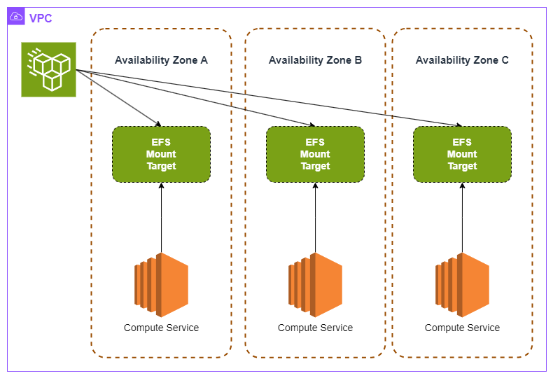

# EFS Fault Tolerant Architecture

Uma arquitetura *fault tolerant* significa a habilidade de uma arquitetura em prover os mecanismos necessários para a aplicação continuar operacional apesar de alguma falha momentânea.

O EFS assim como outros serviços da AWS possui serviços e ferramentas que nos permitem criar uma arquitetura mais "segura" no contexto de falhas.

A utilização da classe *EFS Standard* em conjunto com a criação de um *mount targets* em diferentes AZ's aumenta a resiliência das aplicações.

O modelo comentado acima é explicado com mais detalhes no comparativo entre [EFS One Zone e EFS Standard](./efs-and-multi-az-apps.md#aplicação-multi-za-e-efs-standard).

Para conseguirmos atingir uma *arquitetura fault tolerant*, uma boa prática é também conhecermos as *features* de resiliência dos recursos que se integram ao EFS, entre os principais serviços podemos destacar: *Amazon EC2*, *Amazon ECS*, *Amazon EKS* e *Amazon Fargate*.

**Fault Tolerant EFS Architecture Example**

