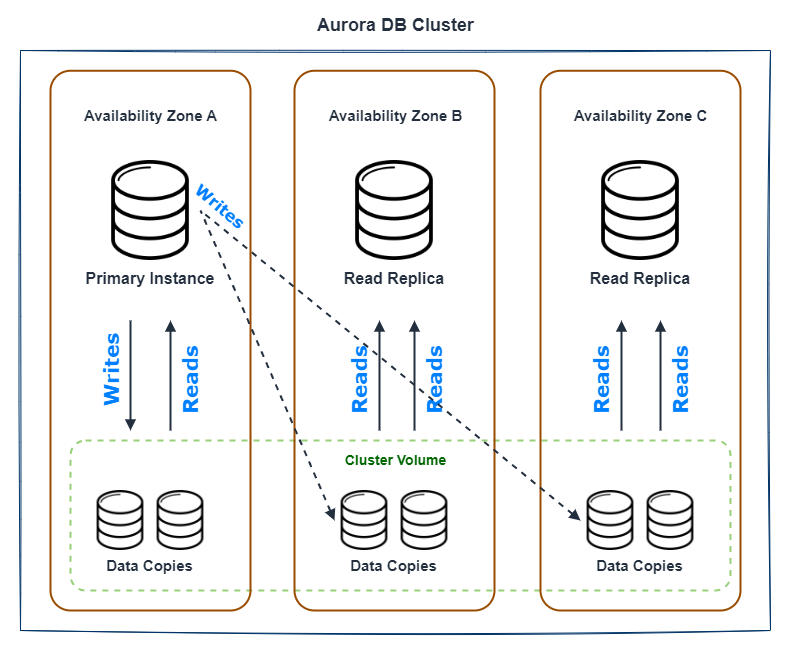

# RDS (Database)

RDS é a base de dados relacional da amazon, sendo compatível com as principais engines *open source* do mercado como MySQL e PostgreSQL, entre outras.

Além destas, o RDS também possui o [Aurora](#rds-aurora-serverless), uma base de dados relacional *serverless* da própria amazon, compatível com as duas *engines open source* mencionadas acima.

Um dos grandes benefícios de se utilizar o RDS é a combinação dele ser um serviço gerenciado pela amazon, provendo maior rapidez, performance e escalabilidade.

Além dele possuir features como: *fault-tolerant* e *self-healing*, a qual diminuem o risco de perda de informações.

## Features

### Resilience

#### Multi-AZ (Failover)

É um recurso do RDS focado em *disaster recovery*.

Por baixo dos panos, o RDS realiza a replicação de todos os dados da base primária para a base segundária.

Em um cenário de alguma eventualidade/anormalidade, não perderemos acesso nossos aos dados.

Pois a AWS se responsabiliza de realizar o *automatic failover* para nós, ou seja, eles mesmos atualizam o DNS da base principal para a base secundária.

Um ponto super importante de termos em mente é que o Multi-AZ NUNCA deve ser pensado/relacionado à performance/escalabilidade, sempre à prevenção à falhas.

> Podemos provocar um *failover* através do *reboot* da base principal, através do console ou através da chamada da *API RebootDBInstance*.

Entre as principais vantagens de utilizarmos o Multi-AZ, podemos destacar:

- Alta disponibiidade dos dados.
- Geração de *backups* e *restores* à partir da base secundária, sem impactar o desempenho da base principal.

#### Replication

**MySQL, Oracle e PostgreSQL** possuem uma **replicação física** dos dados na base secundária, enquanto para o **SQL Server** ocorre uma **replicação lógica**. 

> Ambas *engines* asseguram contra perda de seus dados de *DB instance failure* ou a perda de uma AZ.

#### Redundancy & Self-Repairing Storage 

Pelo fato do RDS replicar os dados armazenados em 3 AZ's tendo cada AZ 2 cópias daqueles dados, podemos considerá-la altamente redundante, além dos discos e blocos de armzenamento serem continuamente *"scaneados"* para encontrar erros e realizar reparações automáticas caracterizando o *self-repairing*/*self-healing*.

> Sempre teremos 6 cópias dos dados armazenados.

### Performance

#### Auto Scaling

O *Aurora Auto Scaling* é uma feature que possibilita a adição de automática de *read Replicas* baseado nas métricas que escolhermos.

Essa configuração permite que o próprio *cluster* adicione ou remova *read replicas* para suportar picos, dessa forma, após o pico, replicas não utilizadas serão removidas.

Disponível apenas para as engines: Aurora MySQL e Aurora PostgreSQL. 

**RDS Auto Scaling Setup**

Para criar um *RDS Auto Scaling*, devemos configurar:

1. Criar uma *Auto Scaling Policy* com as permissões necessárias para o RDS conseguir escalar os recursos.
2. Definir qual *CloudWatch Metric* será monitorado.
3. Definir um *Target Value*, representa o valor desejado de monitoramento da métrica escolhida.

Métricas disponíveis:

- Média do número de conexões.
- Média da utilização de CPU.

Os *target values* diferem para o tipo de métrica selecionado.

Para o número de conexões o *target value*, será o número de conexões permitidas para cada *read replica*.

Caso optarmos pela média de utilização de CPU, será a porcentagem aproximada.

> Podemos opcionalmente desabilitar a opção de *scaling-in actions*, responsáveis por remover as *read replicas* adicionais que não estão sendo mais utilizadas.

O padrão (default) para as *scaling actions* é de 300 segundos, porém pode ser ajustado conforme a necessidade.

APENAS para *scaling* de READ-REPLICAS.

**DB Cluster Volume:**

Utilização de *cluster volumes* para distribuir virtualmente os dados armazenados em múltiplas AZ's.

#### Cache Warming

Para não impactar na performance enquanto novas bases estão sendo provisionadas, o RDS pré-popula seu *buffer pool* com as *queries* mais comuns.

## Monitoring

Os dois cenários mais comuns de monitoramento são geralmente referentes a capacidade de leitura ou escrita.

Caso nossa base RDS esteja sofrendo com a capacidade de escrita o aconselhável é escalarmos o banco através da melhoria do tipo da instância.

Por outro lado, caso o maior impacto seja na leitura e captura dos dados, devemos aumentar o número de *read-replicas*.

## RDS Underlying Architecture

## RDS Aurora Serverless

É outro tipo de engine que podemos escolher no momento que estivermos criando nosso cluster do aurora, send o Aurora Serverless uma engine proprietária da amazon.

Diferente das outras engines, o Aurora Serverless se responsabiliza por toda a parte de escalabilidade por conta própria, não sendo necessário nenhuma configuração adicional ou se preocupar em monitorarmos estes recursos.

Todas as features já disponibilizadas pelo próprio Aurora também valem para o Aurora Serverless, exemplo: *Multi-AZ deployment*, *read-replicas*, *global database*, entre outros.

Ela é ideal para aplicações que não ainda não é possível prever o volume de tráfego e ainda assim é necessário alta disponibilidade.