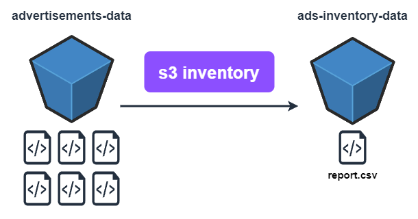

# S3 Inventory

É uma feature do s3 responsável por gerar relatórios de inventário do s3.

Estes relatórios de inventário tem como objetivo auxiliar no entendimento dos objetos armazenados no s3.

O conteúdo do relatório é composto basicamente por metadados dos objetos, a qual estejam alinhados com o objetivo do relatório.

O *s3 inventory*, deve ser configurado a nivel de *bucket*, ou seja, os relatórios sempre levarão em conta os objetos presentes no *bucket* configurado.

## Metadados

Alguns metadados disponíveis são: *object size*, *last modified*, *multipart upload*, *replicated*, *encrypted*, entre outros.

## Agendamento de Frequência (Schedule)

A geração destes relatórios pode ser feita diariamente ou semanalmente.

> O primeiro relatório será disponibilizado somente após 48 horas.

## Como funciona?

## Casos de uso

Sempre que almejarmos listar configurações específicas sobre nossos objetos, como pode ser visto nos exemplos a seguir, devemos optar por utilizar o *s3 inventory*.

- Quais objetos não estão criptografados?
- Quais *storage classes* (classes de armazenamento) estão sendo utilizadas naquele *bucket*?
- Quais objetos foram replicados corretamente?

## Inventory Report

O relatório de inventário será armazenado em um *bucket* próprio no s3, juntamente com todo o histórico de relatórios já criados.

### Extensões disponíveis

- CSV (comma-separated values)
- Apache ORC (optmized row columnar)
- Apache Parquet

### Criptografia

Podemos adicionalmente habilitar *server-side encryption* (criptografia do lado do servidor).

As opções disponíveis, atualmente são:

- SSE-S3 (chave de criptografia do próprio s3)
- SSE-KMS (chave de criptografia do KMS)