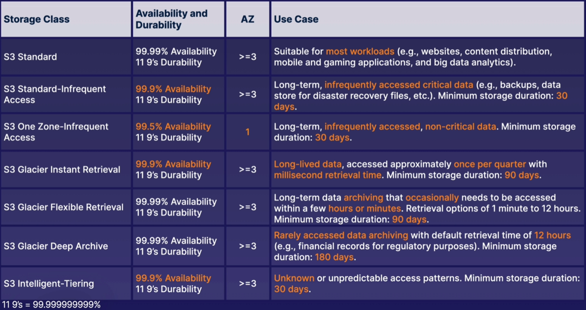

# Classes de armazenamento do s3

O S3 oferece diferentes tipos de classes de armazenamento de acordo com o tipo de caso de uso desejado.

Atualmente temos disponíveis os seguintes *tiers*:

- s3 Standard
- s3 Standard-Infrequent Access
- s3 One Zone-Infrequent Access
- s3 Glacier
- s3 Glacier Deep Archive
- s3 Intelligent-Tiering

## Tiers

### s3 Standard

É o *tier default*, desenvolvido para acesso frequente com alta disponibilidade e durabilidade, sendo adequado para a maioria dos cenários.

Porém, é o *tier* com o maior custo.

### s3 Standard-Infrequent Access

Desenvolvido para armazenamento de arquivos que não são acessados frequentemente porém necessitam serem recuperados o mais rápido possível, com alta disponibilidade e durabilidade.

É adequado para armazenamento de longo prazo, *backups* e *disaster recovery files*.

Custo de armazenamento mais barato comparado ao s3-Standard, porém possui uma taxa adicional para recuperar os arquivos.

Possui uma duração mínima de 30 dias.

### s3 Standard-Infrequent Access

Possui as mesmas características do s3-IA, porém os arquivos são armazenados em apenas 1 AZ (*Availability Zone*).

Também é adequado para armazenamento de longo prazo, acessados infrequentemente, porém apenas para dados não críticos. Caso a AWS perca esta AZ, você perderá seus dados.

Devido à isso possui menor custo comparado ao s3-IA e também menor disponibilidade.

Possui uma duração mínima de 30 dias.

### s3 Glacier

Desenvolvido para armazenamento de baixíssimo custo, otimizado para dados que são realmente acessados com baixíssima frequência.

Deve ser usado apenas para arquivamento de dados, pois é cobrado uma taxa adicional toda cada vez acessos os dados.

Ambos os tipos abaixo possuem uma duração mínima de armazenamento de 90 dias.

#### s3 Glacier Instant Retrieval

Desenvolvido para armazenamento de longa duração, acessados com baixa frequência porém necessita que os dados sejam recuperados o mais rápido possível (milisegundos).

Apresenta menor disponibilidade comparado ao s3 Glacier Flexible Retrieval.

#### s3 Glacier Flexible Retrieval

Desenvolvido para armazenamento de dados que são acessados usualmente, porém não necessitam de uma recuperação imediata.

### s3 Glacier Deep Archive

Desenvolvido para arquivamento de dados que são raramente (ou nunca) acessados, com tempo de recuperação padrão de até 12 horas e duração mínima de armazenamento de 180 dias.

### s3 Intelligent-Tiering

É desenvolvido para aqueles cenários em que ainda não temos noção sobre qual será a frequência de recuperação dos arquivos e nem a política de armazenamento necessária.

Através de inteligência artificial, o s3 irá mover automaticamente os dados entre os tiers (frequent/infrequentl access) que ele julgar ser mais eficiente, focado na otimização de custos.

Possui uma pequena taxa mensal para cada 1.000 objetos.

## Custos (Pricing)

Comparativo de preços decrescente, começando com o mais caro e indo até o mais barato:

1. s3 Standard (Maior custo)
2. Intelligent-Tiering
3. Infrequent Access
4. Glacier (Menor Custo)